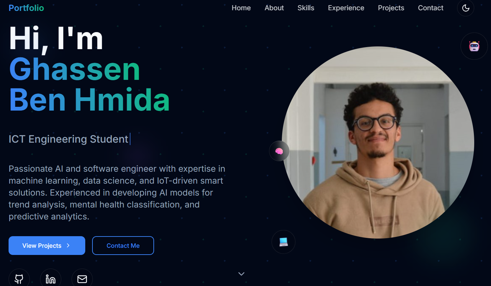

# AI Engineering Portfolio

A modern, responsive portfolio website showcasing expertise in AI, machine learning, and software engineering.

## ✨ Features

- **Responsive Design**: Fully responsive across all devices
- **Dark/Light Mode**: Smooth theme switching with system preference detection
- **Smooth Animations**: Framer Motion powered animations and transitions
- **Modern UI**: Built with shadcn/ui components and Tailwind CSS
- **Contact Form**: Interactive contact form with toast notifications
- **Performance Optimized**: Built with Next.js for optimal performance

## 🎨 Design Highlights

- **Electric Blue & Success Green** color scheme for tech-forward aesthetic
- **Glass morphism effects** for modern visual appeal
- **Animated typing effects** in hero section
- **Progress bars** for skills visualization
- **Timeline layout** for experience section
- **Interactive project cards** with hover effects

## 🚀 Sections

1. **Hero**: Animated introduction with rotating roles
2. **About**: Personal background and technology stack
3. **Skills**: Technical expertise with animated progress bars
4. **Experience**: Education and project timeline
5. **Projects**: Featured work in AI/ML and software development
6. **Contact**: Interactive form and contact information

## 🛠️ Tech Stack

- **Framework**: Next.js 15
- **Styling**: Tailwind CSS
- **UI Components**: shadcn/ui
- **Animations**: Framer Motion
- **Theme**: next-themes
- **Icons**: Lucide React
- **Typography**: Inter & JetBrains Mono

## 📱 Responsive Breakpoints

- Mobile: 320px+
- Tablet: 768px+
- Desktop: 1024px+
- Large: 1280px+

## 🌐 Live Website & Preview

Check out the live portfolio here:  
👉 [**Visit Portfolio Website**]([https://my-portfolio-delta-ashen-37.vercel.app/))

### Website Preview

*(Replace `website_preview.png` with your actual screenshot file inside the repo root.)*

## 🎯 Key Achievements Showcased

- Machine Learning and AI models
- Computer vision applications
- LLM implementations
- Competitive programming participation
- Full-stack development experience

---

*Built with ❤️ and lots of coffee*
